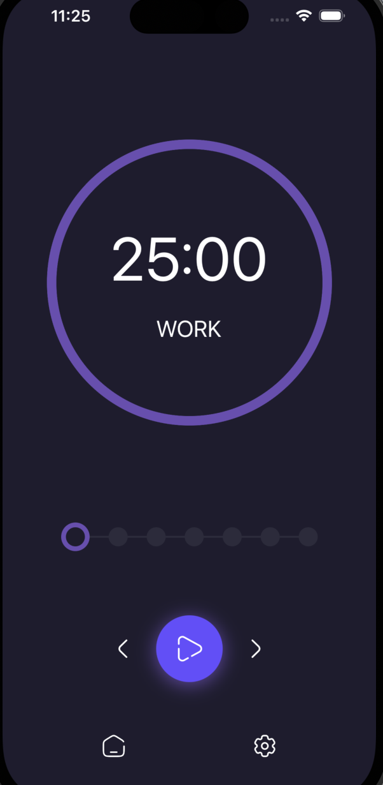
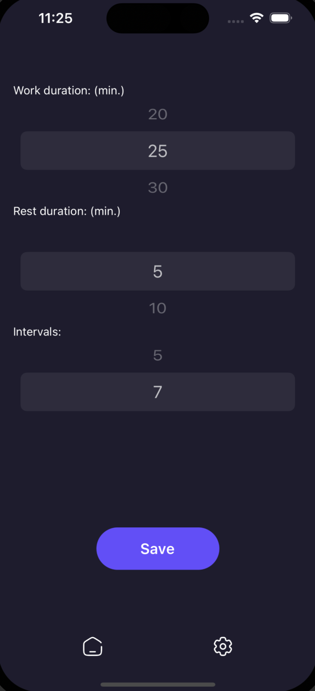
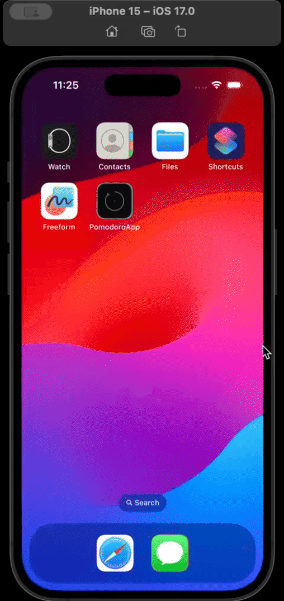

# Pomodoro Timer App

The Pomodoro Timer App is a productivity tool designed to help users manage their time more effectively using the Pomodoro Technique. With a simple and intuitive interface, this app allows users to alternate work sessions with short breaks to maximize focus and efficiency. Built with React Native and TypeScript, it's a cross-platform solution for time management.

## Features

- **Pomodoro Timer**: Stay focused by working in timed intervals (known as "pomodoros").
- **Customizable Sessions**: Adjust work and break durations to fit your personal productivity flow.
- **Session Counter**: Keeps track of the number of pomodoros completed to help maintain your productivity rhythm.
- **Simple Navigation**: Seamlessly switch between Timer and Settings pages with just a tap.

## Getting Started

Follow these steps to get started with the Pomodoro Timer App:

1. **Clone the Repository**: Clone the project to your local machine using Git.
2. **Install Dependencies**: Run `npm install` or `yarn install` to install the required dependencies.
3. **Run the App**: Execute `npx react-native run-ios` or `npx react-native run-android` to start the app on your preferred platform.

## Usage

The Pomodoro Timer App is designed to be straightforward:

1. Use the Timer page to start and track your work sessions.
2. Switch to the Settings page to customize the durations of your work and break periods.
3. Monitor your progress with the session counter at the bottom of the Timer page.

## Screenshots

Here are some screenshots showcasing the Pomodoro Timer App in use:

## Demo Video

Check out this video to see the Pomodoro Timer App in action:

</a>

## Contributing

Contributions are what make the open-source community such an amazing place to learn, inspire, and create. Any contributions you make are **greatly appreciated**.

## Feedback

We would love to hear your thoughts on the Pomodoro Timer App! If you have any feedback or suggestions, please reach out to us.

## License

This Pomodoro Timer App is open-sourced software licensed under the MIT License. See the LICENSE file for more information.
